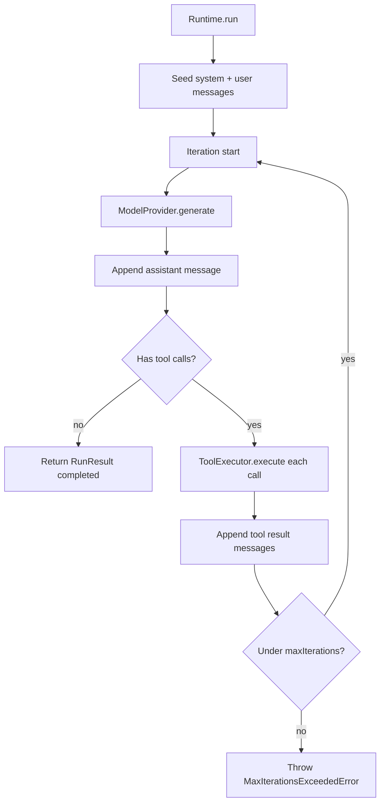

<p align="center">
  
</p>

<h1 align="center">Harbor</h1>

<p align="center"><strong>A runtime-first AI Agent SDK for TypeScript.</strong></p>

<p align="center">
  Build agents with tools, run iterative model loops, and keep providers swappable — without tying your app to a vendor SDK.
</p>

<p align="center">
  <a href="./docs">Docs</a>
  ·
  <a href="./examples">Examples</a>
  ·
  <a href="./CONTRIBUTING.md">Contributing</a>
  ·
  <a href="./LICENSE">MIT License</a>
</p>

<p align="center">
  <sub>Preview docs locally with <code>pnpm docs:dev</code>. Hosted docs: connect this repo in <a href="https://app.mintlify.com">Mintlify</a> (subdirectory <code>docs</code>) — see <a href="./CONTRIBUTING.md#publishing-mintlify-hosting">CONTRIBUTING</a>.</sub>
</p>

---

## Features

- **Runtime-first loop** — `Runtime.run()` drives generate → tool → append until the model is done
- **First-class tools** — register typed tools on an `Agent`; Harbor validates and executes them
- **Provider abstraction** — talk to models through `ModelProvider`; swap OpenAI for mocks in tests
- **Events** — observe runs with `onEvent` (`tool.start`, `provider.response`, …)
- **Tracing** — every run returns `RunResult.trace` with provider and tool spans
- **OpenAI included** — production `OpenAIProvider` in `@harbor/providers`
- **TypeScript-native** — strict types, dual ESM/CJS builds, Node.js 20+

## Installation

```sh
pnpm add @harbor/core @harbor/providers
# or: npm install @harbor/core @harbor/providers
```

Set an API key for the OpenAI provider:

```sh
export OPENAI_API_KEY=sk-...
```

## Quick Start

```ts
import { Agent, Runtime, type Tool } from "@harbor/core";
import { OpenAIProvider } from "@harbor/providers";

const getTime: Tool = {
  name: "get_time",
  description: "Return the current UTC time as an ISO-8601 string.",
  parameters: { type: "object", properties: {} },
  execute() {
    return new Date().toISOString();
  },
};

const agent = new Agent({
  name: "quickstart",
  provider: new OpenAIProvider({ model: "gpt-4o-mini" }),
  instructions: "When asked for the time, call get_time and answer briefly.",
  tools: [getTime],
});

const result = await new Runtime().run({
  agent,
  input: "What time is it in UTC right now?",
});

console.log(result.output?.content);
```

Runnable copy: [`examples/quickstart`](./examples/quickstart).

```sh
pnpm install && pnpm build
export OPENAI_API_KEY=sk-...
pnpm --filter @harbor/example-quickstart start
```

## Architecture overview

Harbor is a pnpm + Turbo monorepo. **Core never depends on a vendor SDK**; providers adapt vendors into Harbor types.

| Package                                     | Role                                                             |
| ------------------------------------------- | ---------------------------------------------------------------- |
| [`@harbor/core`](./packages/core)           | `Agent`, `Runtime`, tools, messages, provider interfaces, errors |
| [`@harbor/providers`](./packages/providers) | `OpenAIProvider` and OpenAI message/tool mappers                 |
| [`@harbor/utils`](./packages/utils)         | Shared utilities (stub today)                                    |

```text
Your app
  └─ Agent (instructions + tools + ModelProvider)
       └─ Runtime.run()
            ├─ ModelProvider.generate()
            └─ ToolExecutor.execute()
```

## Core Concepts

| Concept           | What it is                                                                         |
| ----------------- | ---------------------------------------------------------------------------------- |
| **Agent**         | Configured identity: name, instructions, tools, provider, model                    |
| **Runtime**       | Executes the iterative agent loop and returns a `RunResult`                        |
| **Tool**          | Named function the model may call (`name`, `description`, `parameters`, `execute`) |
| **ModelProvider** | Vendor-agnostic generate/stream interface                                          |
| **Message**       | Role-based transcript entries (`system` / `user` / `assistant` / `tool`)           |

## Agent example

```ts
import { Agent } from "@harbor/core";
import { OpenAIProvider } from "@harbor/providers";

const agent = new Agent({
  name: "assistant",
  provider: new OpenAIProvider({ model: "gpt-4o-mini" }),
  instructions: "You are concise and accurate.",
  model: "gpt-4o-mini",
  maxIterations: 8,
});
```

## Tool example

```ts
import type { JsonObject, Tool } from "@harbor/core";

const add: Tool = {
  name: "add",
  description: "Add two numbers.",
  parameters: {
    type: "object",
    properties: {
      a: { type: "number" },
      b: { type: "number" },
    },
    required: ["a", "b"],
  },
  execute(args: JsonObject) {
    return Number(args["a"]) + Number(args["b"]);
  },
};
```

Pass tools when constructing the agent: `tools: [add]`.

## Runtime flow



## Provider abstraction

```ts
import type { ModelProvider } from "@harbor/core";
import { MockProvider } from "@harbor/core";
import { OpenAIProvider } from "@harbor/providers";

// Production
const openai: ModelProvider = new OpenAIProvider({
  apiKey: process.env.OPENAI_API_KEY,
  model: "gpt-4o-mini",
});

// Tests — scripted responses, no network
const mock: ModelProvider = new MockProvider({
  responses: [MockProvider.text("hello")],
});
```

Core defines `ModelProvider`. Vendor SDKs stay inside `@harbor/providers`.

## Tracing

Successful and failed runs expose timing spans on `RunResult.trace`:

```ts
const result = await runtime.run({ agent, input: "…" });

for (const span of result.trace?.spans ?? []) {
  console.log(span.name, span.endTime! - span.startTime, span.status);
}
// e.g. "provider.generate", "tool.execute"
```

## Events

Subscribe with `onEvent` on each run (or via `new Runtime({ onEvent })`):

```ts
await runtime.run({
  agent,
  input: "What is 2 + 2?",
  onEvent(event) {
    switch (event.type) {
      case "tool.start":
        console.log("tool →", event.toolCall.name);
        break;
      case "tool.end":
        console.log("←", event.toolResult.content);
        break;
      case "provider.response":
        console.log("model replied");
        break;
      default:
        break;
    }
  },
});
```

Emitted types include `run.start`, `run.end`, `iteration.start` / `end`, `provider.request` / `response`, `message`, `tool.start` / `end`, and `error`.

## Error handling

| Error                               | When                                                                      |
| ----------------------------------- | ------------------------------------------------------------------------- |
| `ProviderError`                     | Provider/auth/rate-limit/transport failures (wrapped by `OpenAIProvider`) |
| `ToolValidationError` / `ToolError` | Bad tool args or tool execution failure (surfaced on `ToolResult`)        |
| `MaxIterationsExceededError`        | Model/tool loop exceeded `maxIterations`                                  |
| `NotImplementedError`               | `Runtime.stream` / `resume` / `cancel`, `OpenAIProvider.stream`           |
| `HarborError`                       | Base class for Harbor failures                                            |

```ts
import { HarborError, MaxIterationsExceededError } from "@harbor/core";

try {
  await runtime.run({ agent, input: "…" });
} catch (error) {
  if (error instanceof MaxIterationsExceededError) {
    console.error("loop limit hit", error.maxIterations);
  } else if (error instanceof HarborError) {
    console.error(error.code, error.message);
  } else {
    throw error;
  }
}
```

## Roadmap

- [ ] Streaming (`Runtime.stream`, provider streams)
- [ ] Run resume / cancel
- [ ] Durable session persistence (beyond the `Session` type)
- [ ] Additional providers (Anthropic, etc.)
- [ ] Memory and richer observability exporters
- [ ] Expand `@harbor/utils`

## Examples

| Example                                            | Demonstrates                     |
| -------------------------------------------------- | -------------------------------- |
| [`examples/quickstart`](./examples/quickstart)     | Agent + tool + `Runtime.run()`   |
| [`examples/weather`](./examples/weather)           | Tool loop with a weather lookup  |
| [`examples/tool-calling`](./examples/tool-calling) | Multiple tools and run events    |
| [`examples/multi-agent`](./examples/multi-agent)   | Agents composing via nested runs |

More detail in the Mintlify docs under [`docs/`](./docs). Preview with `pnpm docs:dev`. Publish via Mintlify (subdirectory `docs`) — see [CONTRIBUTING](./CONTRIBUTING.md#publishing-mintlify-hosting). Example catalog: [`docs/examples/overview.mdx`](./docs/examples/overview.mdx).

## Contributing

See [`CONTRIBUTING.md`](./CONTRIBUTING.md) for development setup, build/test/lint, and the Changesets release process.

## License

[MIT](./LICENSE)
