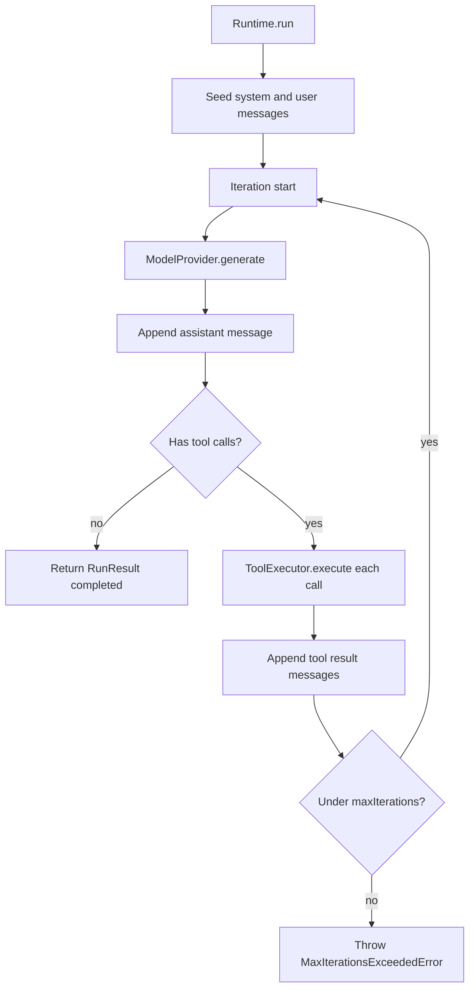
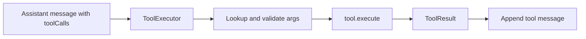
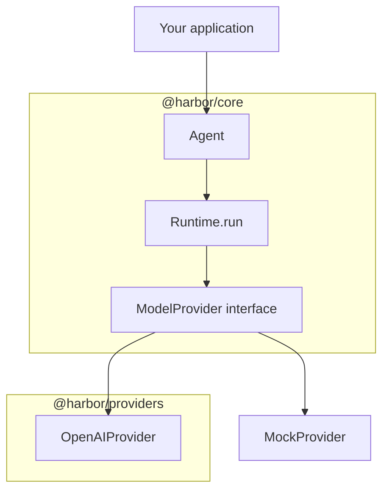

Harbor is an open-source, **runtime-first** AI Agent SDK for TypeScript.

You configure an `Agent` (instructions, tools, provider), call `Runtime.run()`, and get a structured `RunResult` — without tying your application to a vendor SDK.

## Why Harbor

- **Runtime-first loop** — generate → tool → append until the model is done
- **First-class tools** — validate and execute tools inside the runtime
- **Provider abstraction** — swap `OpenAIProvider` for `MockProvider` in tests
- **Events and tracing** — observe runs live and inspect `RunResult.trace`
- **TypeScript-native** — strict types, dual ESM/CJS, Node.js 20+

## Packages

| Package             | Role                                                             |
| ------------------- | ---------------------------------------------------------------- |
| `@harbor/core`      | `Agent`, `Runtime`, tools, messages, provider interfaces, errors |
| `@harbor/providers` | `OpenAIProvider` and OpenAI message/tool mappers                 |
| `@harbor/utils`     | Shared utilities (stub today)                                    |

Core never depends on a vendor SDK. Providers adapt vendors into Harbor types.

## Architecture

### Runtime loop

### Tool execution flow

### Provider abstraction

## Limitations

These APIs exist but are **not implemented** yet and throw `NotImplementedError`:

- `Runtime.stream`, `Runtime.resume`, `Runtime.cancel`
- `OpenAIProvider.stream`

`Session` is a public **type** only — Harbor does not persist sessions. `@harbor/utils` is a stub.

## Next steps

<CardGroup cols={2}>
  <Card title="Getting started" icon="rocket" href="/getting-started">
    Install Harbor and understand the mental model.
  </Card>
  <Card title="Quick Start" icon="play" href="/quickstart">
    Build your first agent with a tool in minutes.
  </Card>
</CardGroup>
