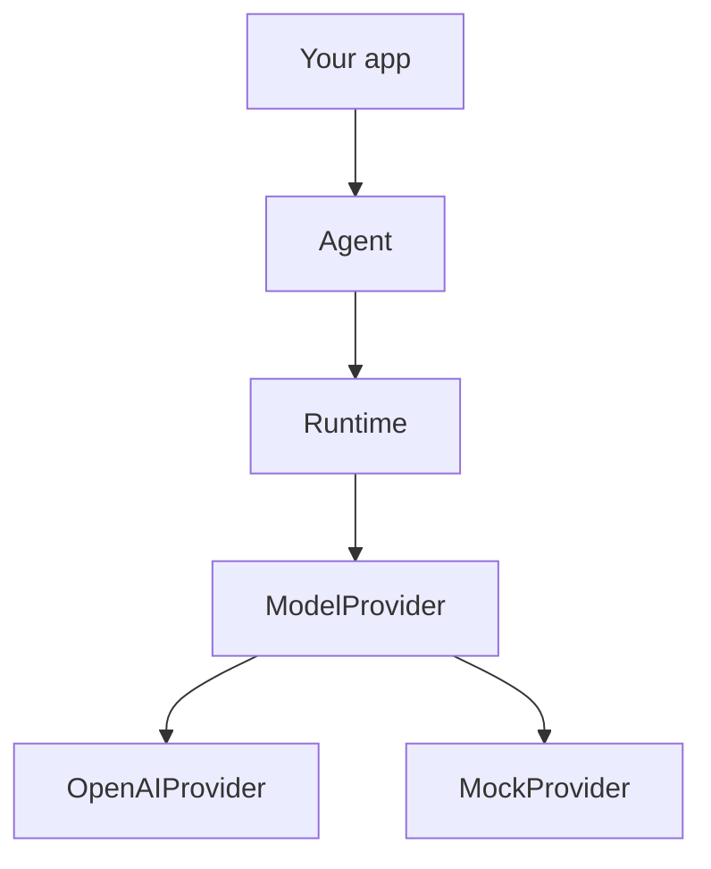

Harbor talks to models through the `ModelProvider` interface in `@harborts/core`. Vendor SDKs live only in `@harborts/providers` (or your own adapter package).

## Provider abstraction



```text
@harborts/providers ──depends on──▶ @harborts/core
@harborts/core      ──must not──▶  @harborts/providers
```

## ModelProvider

Implementations provide:

- `id` — stable provider identifier
- `capabilities` — streaming, tools, structured output, system messages
- `generate(request)` — complete response
- `stream(request)` — async iterable of stream events
- optional `getModelInfo(modelId)`

## OpenAI

```ts
import { OpenAIProvider } from "@harborts/providers";
// or: import { OpenAIProvider } from "@harborts/providers/openai";

const provider = new OpenAIProvider({
  apiKey: process.env.OPENAI_API_KEY, // optional if env is set
  model: "gpt-4o-mini",
  organization: process.env.OPENAI_ORG_ID,
  baseURL: process.env.OPENAI_BASE_URL,
});

const response = await provider.generate({
  messages: [
    {
      id: "u1",
      role: "user",
      content: "Hello",
      createdAt: Date.now(),
    },
  ],
});

console.log(response.message.content);
console.log(response.finishReason);
console.log(response.usage);
```

SDK failures are wrapped in `ProviderError` — callers should not catch raw OpenAI errors from `generate()`.

Lower-level mappers are also exported: `toOpenAIMessages`, `fromOpenAIResponse`, `toOpenAITools`.

## Mock provider (tests)

```ts
import { Agent, MockProvider, Runtime } from "@harborts/core";

const provider = new MockProvider({
  responses: [
    MockProvider.toolCalls([{ id: "call_1", name: "add", arguments: { a: 1, b: 2 } }]),
    MockProvider.text("The sum is 3."),
  ],
});

const agent = new Agent({
  name: "test",
  provider,
  tools: [
    {
      name: "add",
      description: "Add two numbers.",
      parameters: {
        type: "object",
        properties: { a: { type: "number" }, b: { type: "number" } },
        required: ["a", "b"],
      },
      execute: (args) => Number(args["a"]) + Number(args["b"]),
    },
  ],
});

const result = await new Runtime().run({ agent, input: "1+2?" });
console.log(result.output?.content); // "The sum is 3."
```

## Limitations

- `OpenAIProvider.stream()` throws `NotImplementedError`
- `MockProvider.stream` exists for tests only
- Additional vendors (Anthropic, etc.) are not shipped yet — implement `ModelProvider` yourself
