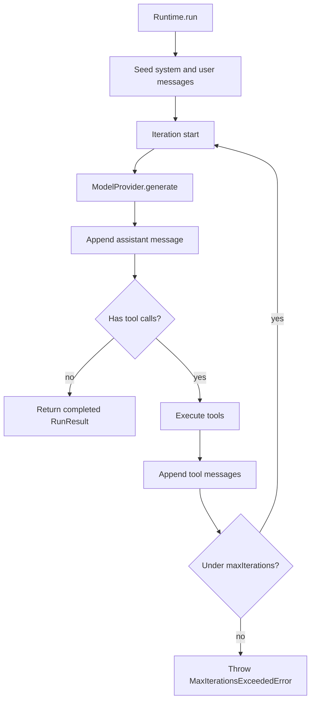

`Runtime` executes Harbor agents. Today the supported entry point is `run()`.

```ts
import { Agent, Runtime } from "@harborts/core";
import { OpenAIProvider } from "@harborts/providers";

const runtime = new Runtime({
  maxIterations: 10,
  onEvent(event) {
    if (event.type === "iteration.start") {
      console.log("iteration", event.iteration);
    }
  },
});

const agent = new Agent({
  name: "demo",
  provider: new OpenAIProvider({ model: "gpt-4o-mini" }),
  instructions: "Be brief.",
});

const result = await runtime.run({
  agent,
  input: "Say hello in five words.",
});
```

## Runtime loop



## RunOptions

| Field           | Description                                       |
| --------------- | ------------------------------------------------- |
| `agent`         | `Agent` to execute                                |
| `input`         | `string`, a single `Message`, or `Message[]`      |
| `sessionId`     | Optional id attached to `RunContext`              |
| `maxIterations` | Cap on generate/tool loops (default `10`)         |
| `signal`        | `AbortSignal` for cooperative cancel during a run |
| `metadata`      | Arbitrary JSON metadata on the run context        |
| `onEvent`       | Listener for `RuntimeEvent` values                |

Iteration limit resolution: `RunOptions.maxIterations` → `AgentConfig.maxIterations` → `Runtime` defaults → `10`.

## RunResult

```ts
console.log(result.runId);
console.log(result.status); // "completed" | "failed" | "cancelled" | …
console.log(result.output?.content);
console.log(result.messages.length);
console.log(result.trace?.spans);
```

On failure Harbor emits `run.end` and **rethrows** a `HarborError` (for example `MaxIterationsExceededError`). Always `try/catch` around `run()`.

## Events

Emitted types include `run.start`, `run.end`, `iteration.start` / `end`, `provider.request` / `response`, `message`, `tool.start` / `end`, and `error`.

```ts
await runtime.run({
  agent,
  input: "What is 2 + 2?",
  onEvent(event) {
    if (event.type === "tool.start") {
      console.log("tool →", event.toolCall.name);
    }
  },
});
```

## Limitations

These methods exist on `Runtime` but throw `NotImplementedError`:

- `stream()`
- `resume()`
- `cancel()` — use `AbortSignal` on an in-flight `run` instead
