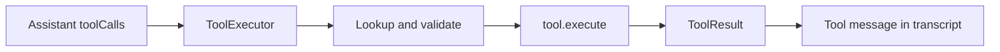

Tools are plain objects that implement Harbor's `Tool` interface. Register them on an `Agent`; the runtime exposes their definitions to the provider and executes calls through `ToolExecutor`.

## Tool execution flow



## Defining a tool

```ts
import type { JsonObject, Tool } from "@harbor/core";

const celsiusToFahrenheit: Tool = {
  name: "celsius_to_fahrenheit",
  description: "Convert a Celsius temperature to Fahrenheit.",
  parameters: {
    type: "object",
    properties: {
      celsius: { type: "number" },
    },
    required: ["celsius"],
  },
  execute(args: JsonObject) {
    return (Number(args["celsius"]) * 9) / 5 + 32;
  },
};
```

`parameters` is a JSON-Schema-like object. Harbor validates required properties and basic types before calling `execute`.

## Registration

```ts
import { Agent } from "@harbor/core";
import { OpenAIProvider } from "@harbor/providers";

const agent = new Agent({
  name: "tools",
  provider: new OpenAIProvider({ model: "gpt-4o-mini" }),
  instructions: "Prefer calling tools over estimating.",
  tools: [celsiusToFahrenheit],
});
```

## Execution results

`ToolExecutor` never throws raw tool failures into the runtime loop. Failures become a `ToolResult` with `isError: true` and a structured `ToolError`, which is converted into a tool message for the model.

Successful results are JSON-stringified (or stringified primitives) into `ToolResult.content`.

## Using ToolExecutor directly

```ts
import { ToolExecutor, type ToolCall } from "@harbor/core";

const executor = new ToolExecutor([celsiusToFahrenheit]);

const call: ToolCall = {
  id: "call_1",
  name: "celsius_to_fahrenheit",
  arguments: { celsius: 19 },
};

const toolResult = await executor.execute(call, {
  runId: "run_1",
  agentName: "tools",
});

console.log(toolResult.content);
console.log(toolResult.durationMs);
```

## Observing tool calls

```ts
import { Agent, Runtime } from "@harbor/core";
import { OpenAIProvider } from "@harbor/providers";

const runtime = new Runtime();
const agent = new Agent({
  name: "tools",
  provider: new OpenAIProvider({ model: "gpt-4o-mini" }),
  instructions: "Prefer calling tools over estimating.",
  tools: [celsiusToFahrenheit],
});

await runtime.run({
  agent,
  input: "Convert 19°C to Fahrenheit.",
  onEvent(event) {
    if (event.type === "tool.start") {
      console.log(event.toolCall.name, event.toolCall.arguments);
    }
    if (event.type === "tool.end") {
      console.log(event.toolResult.content, event.toolResult.isError);
    }
  },
});
```

## Limitations

Tool schemas are lightweight JSON-Schema-like checks, not a full JSON Schema validator. Parallel tool calls are executed sequentially in the current runtime loop.
